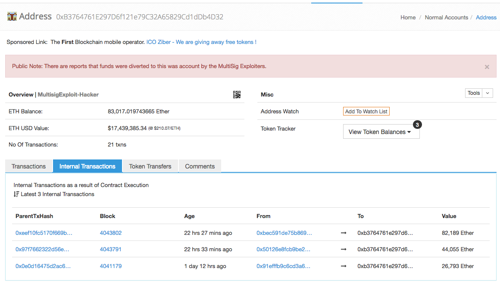
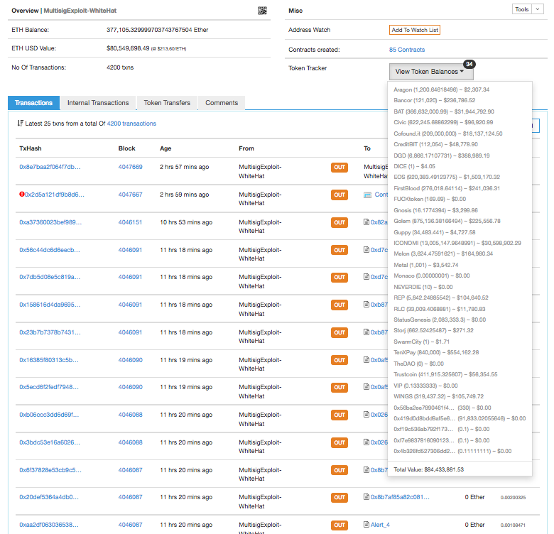
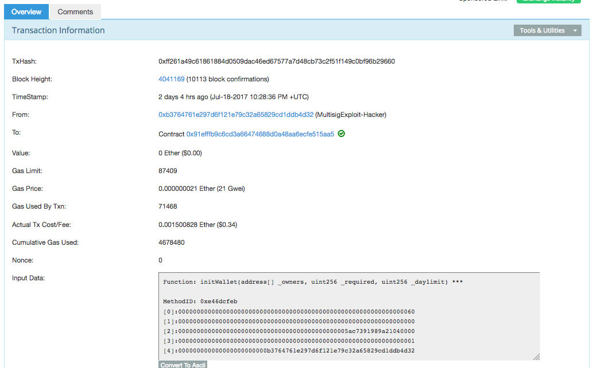
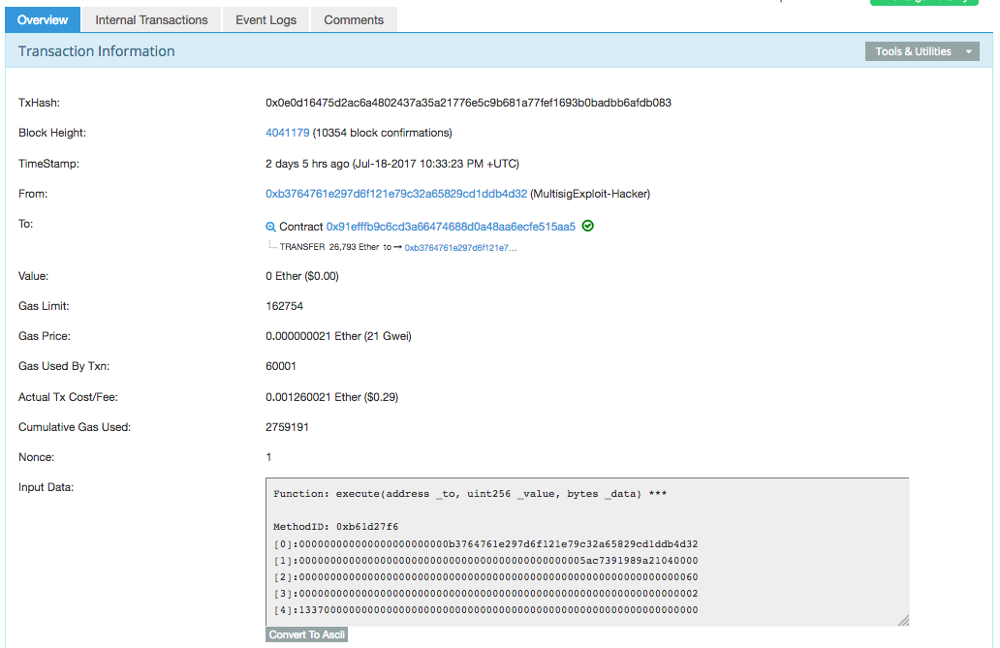

# Parity Multisig Recovery Reconciliation

On Jul 18 2017, a black hat hacker exploited a vulnerability in the multisig wallet deployed from the Parity Ethereum node application, and stole
USD 32 million in ethers (ETH) from the funds raised in crowdsales by Aeternity, Edgeless ans Swarm city.

The White Hat Group (WHG) scanned the balances for over 500 multisig wallets using the same vulnerable code, then used the same exploit
to move the ETH and tokens from the wallets into their wallet for safekeeping.

The reconciliation below calculates the ETH and tokens that will be returned to their rightful owners in safer multisig wallets that are
handed back to the original wallet owners.

<br />

<hr />

## Table Of Contents

* [Black Hat Hacker](#black-hat-hacker)
* [White Hat Group](#white-hat-group)
* [Reconciliation](#reconciliation)
  * [Tokens](#tokens)
  * [Ethers](#ethers)
* [How Was The Parity Multisig Compromised?](#how-was-the-parity-multisig-compromised)
* [Further Information](#further-information)

<br />

<hr />

## Black Hat Hacker
A [bug](https://github.com/paritytech/parity/commit/b640df8fbb964da7538eef268dffc125b081a82f) in the Parity multisig wallet was discovered by a (or a group of) black hat hacker(s).

The hacker executed a transaction calling the `initWallet(address[] _owners, uint256 _required, uint256 _daylimit)` function to gain control of any of these vulnerable multisig accounts - [first hack tx](https://etherscan.io/tx/0xff261a49c61861884d0509dac46ed67577a7d48cb73c2f51f149c0bf96b29660).
The hacker could then execute a transaction calling the `execute(address _to, uint256 _value, bytes _data)` function to transfer out any funds or tokens in the multisig wallet - [first hack tx](https://etherscan.io/tx/0x0e0d16475d2ac6a4802437a35a21776e5c9b681a77fef1693b0badbb6afdb083).

The hacker used this exploit to transfer amounts from the following accounts to the hacker(s) account [0xb3764761e297d6f121e79c32a65829cd1ddb4d32](https://etherscan.io/address/0xb3764761e297d6f121e79c32a65829cd1ddb4d32):

* Edgeless - ETH 26,793 (USD 5,732,148.01) from [0x91efffb9c6cd3a66474688d0a48aa6ecfe515aa5](https://etherscan.io/address/0x91efffb9c6cd3a66474688d0a48aa6ecfe515aa5#internaltx) at Jul-18-2017 10:33:23 PM +UTC in block [4041179](https://etherscan.io/block/4041179) in tx [0x0e0d1647](https://etherscan.io/tx/0x0e0d16475d2ac6a4802437a35a21776e5c9b681a77fef1693b0badbb6afdb083)
* Swarm City - ETH 44,055 (USD 9,425,214.81) from [0x50126e8fcb9be29f83c6bbd913cc85b40eaf86fc](https://etherscan.io/address/0x50126e8fcb9be29f83c6bbd913cc85b40eaf86fc#internaltx) at Jul-19-2017 12:14:18 PM +UTC in block [4043791](https://etherscan.io/block/4043791) in tx [0x97f76623](https://etherscan.io/tx/0x97f7662322d56e1c54bd1bab39bccf98bc736fcb9c7e61640e6ff1f633637d38)
* æternity - ETH 82,189 (USD 17,583,679.04) from [0xbec591de75b8699a3ba52f073428822d0bfc0d7e](https://etherscan.io/address/0xbec591de75b8699a3ba52f073428822d0bfc0d7e#internaltx) at Jul-19-2017 12:19:36 PM +UTC in block [4043802](https://etherscan.io/block/4043802) in tx [0xeef10fc5](https://etherscan.io/tx/0xeef10fc5170f669b86c4cd0444882a96087221325f8bf2f55d6188633aa7be7c)
* Total ETH 153,037 (USD 32,741,041.85)

ETH/USD rate of 213.942 at 20:45 Jul 20 2017 AEST.

Following is a balance of the hacker's account, with 7 lots of ETH 10,000 already transferred out, at 21:31 Jul 20 2017 AEST: 



<br />

<hr />

## White Hat Group

The White Hat Group (WHG) found [570 contracts with the same byte code](https://etherscan.io/find-similiar-contracts?a=0xbcb2797f9a74d9099d6077c743feb3bc812eb2a4) and drained about USD 164 million in ETH and tokens using the same exploit as used by the hacker into [0x1dba1131000664b884a1ba238464159892252d3a](https://etherscan.io/address/0x1dba1131000664b884a1ba238464159892252d3a).

The first WHG action was in block [4044813](https://etherscan.io/block/4044813) at Jul-19-2017 05:27:10 PM +UTC and the last action was in block [4046151](https://etherscan.io/block/4046151) Jul-20-2017 12:25:26 AM +UTC and here is the balance of the WHG account at 21:20 Jul 20 2017 AEST:

The nonce for the first tx in block 4044813 is 630 and the nonce for the last tx in block 4046151 is 4165. A total of 4615 - 630 + 1 = 3986 transactions were executed by the WHG to rescue the ethers and tokens at risk.

Total gas cost for the last 2,000 transactions is 14.58969814 ETH. Etherscan only exported the last 2,000 transactions for this calculation.



<br />

<hr />

## Reconciliation

I've use the [scripts/getWHGTxs.sh](scripts/getWHGTxs.sh) to extract all transactions moving ETH and tokens from the vulnerable Parity multisig wallets into the WHG's wallet.

**NOTE**

* There is a tx moving 1.9 ETH from the Dao.Casino multisig at 0x01dbb419d66be0d389fab88064493f1d698dc27a where the initiating account was 0x7ec74161ab8b8cb6d2c6ad317d9734a6056b8a52 - https://etherscan.io/tx/0xcd35dd43bba29abd528b25d55f72ac3e4ffd1bdd787ffe956e40347dd948e0d3 . It's not included in my results.

<br />

### Tokens
The WHG token transactions are in [results/tokensRefunds-WHG.tsv](results/tokensRefunds-WHG.tsv).

My token transactions are in [results/tokens.tsv](results/tokens.tsv).

A reconciliation of WHG's and my token transactions shows one small error in line 51 Monaco in the WHG's calculations - see [results/tokensReconcilation.xls](results/tokensReconcilation.xls).

My latest token results for comparison with the WHG rescue data is in [results/multisig_rescue_tokens_bokkypoobah.csv](results/multisig_rescue_tokens_bokkypoobah.csv).

Also note that my .csv file numbers have small rounding issues as I used MS Excel to compute the cumulative amounts. See the .tsv file for the exact amounts in weis.

<br />

### Ethers

My ethers transactions are in [results/ethers.tsv](results/ethers.tsv).

LefterisJP's ethers transactions are in [results/ethers-LefterisJP.csv](results/ethers-LefterisJP.csv) from [https://github.com/LefterisJP/multisigwallet_whitehat_movements_verification/blob/master/multisig_data.csv](https://github.com/LefterisJP/multisigwallet_whitehat_movements_verification/blob/master/multisig_data.csv).

A reconciliation of LefterisJP and my ethers transactions is available in [results/ethersReconciliation.xls](results/ethersReconciliation.xls) and the numbers match exactly.

My latest ethers results for comparison with the WHG rescue data is in [results/multisig_rescue_ether_bokkypoobah.csv](results/multisig_rescue_ether_bokkypoobah.csv).

Note that my ethers data seems to have an incorrect entry when compared to Jordi's data and from manual checking.
The only difference between mine and Jordis ETH data is that I have an extra amount `0x32bacc8b241fb172fee18bda32527126c6f3c5f7 963930173170731000000`.
This transaction was picked up by my script because I looked at each transaction in the blocks containing the rescue transactions, and this
`0x32bacc8b241fb172fee18bda32527126c6f3c5f7` account is not an account that was rescued.

Jordi's file [results/multisig_resque_eth_jordi.csv](results/multisig_resque_eth_jordi.csv) is correct.

Also note that my .csv file numbers have small rounding issues as I used MS Excel to compute the cumulative amounts. See the .tsv file for the exact amounts in weis.

<br />

<hr />

## How Was The Parity Multisig Compromised?

The first attack transaction [0xff261a49](https://etherscan.io/tx/0xff261a49c61861884d0509dac46ed67577a7d48cb73c2f51f149c0bf96b29660) 
was a call to the `initWallet(...)` function with the new owner's address `b3764761e297d6f121e79c32a65829cd1ddb4d32` passed and the amount to
be stolen (`new BigNumber("5ac7391989a21040000",16).shift(-18)` = `26793`) as the `_daylimit`parameters:



After the change in ownership, the hacker sent a [second transaction](https://etherscan.io/tx/0x0e0d16475d2ac6a4802437a35a21776e5c9b681a77fef1693b0badbb6afdb083) to steal the funds:



Following is the bit of code with the vulnerability (note the comment "constructor", but this is a regular function):

```javascript
    // constructor - just pass on the owner array to the multiowned and
    // the limit to daylimit
    function initWallet(address[] _owners, uint _required, uint _daylimit) {
        initMultiowned(_owners, _required);
        initDaylimit(_daylimit) ;
    }
```

And `initWallet(...)` called the following `initMultiowned(...)` function to change the ownership of the multisig contract:

```javascript
  // constructor is given number of sigs required to do protected "onlymanyowners" transactions
  // as well as the selection of addresses capable of confirming them.
  function initMultiowned(address[] _owners, uint _required) {
    m_numOwners = _owners.length + 1;
    m_owners[1] = uint(msg.sender);
    m_ownerIndex[uint(msg.sender)] = 1;
    for (uint i = 0; i < _owners.length; ++i)
    {
      m_owners[2 + i] = uint(_owners[i]);
      m_ownerIndex[uint(_owners[i])] = 2 + i;
    }
    m_required = _required;
  }
```

This code above was originally the constructor for the Ethereum Wallet multisig wallet contract (below). In Ethereum, the smart contract
constructor code is executed when a contract is deployed to the blockchain, BUT the constructor code is not included in the deployed
Ethereum Virtual Machine code. 

The mistake here was that the constructor was modified to be a regular function (that is included in the
deployed code), and no further checks were placed to restrict the function to only being executable by the existing wallet owner.

Following is the code from the [original Ethereum Wallet multisig](https://github.com/ethereum/dapp-bin/blob/master/wallet/wallet.sol)
called `contract multiowned`, where the constructor has the same name `multiowned(...)`:

```javascript
    // constructor is given number of sigs required to do protected "onlymanyowners" transactions
    // as well as the selection of addresses capable of confirming them.
    function multiowned(address[] _owners, uint _required) {
        m_numOwners = _owners.length + 1;
        m_owners[1] = uint(msg.sender);
        m_ownerIndex[uint(msg.sender)] = 1;
        for (uint i = 0; i < _owners.length; ++i)
        {
            m_owners[2 + i] = uint(_owners[i]);
            m_ownerIndex[uint(_owners[i])] = 2 + i;
        }
        m_required = _required;
}
``` 

>br />

The full source code for the buggy contract from [https://github.com/paritytech/parity/blob/4d08e7b0aec46443bf26547b17d10cb302672835/js/src/contracts/snippets/enhanced-wallet.sol](https://github.com/paritytech/parity/blob/4d08e7b0aec46443bf26547b17d10cb302672835/js/src/contracts/snippets/enhanced-wallet.sol) follows:

```javascript
//sol Wallet
// Multi-sig, daily-limited account proxy/wallet.
// @authors:
// Gav Wood <g@ethdev.com>
// inheritable "property" contract that enables methods to be protected by requiring the acquiescence of either a
// single, or, crucially, each of a number of, designated owners.
// usage:
// use modifiers onlyowner (just own owned) or onlymanyowners(hash), whereby the same hash must be provided by
// some number (specified in constructor) of the set of owners (specified in the constructor, modifiable) before the
// interior is executed.

pragma solidity ^0.4.9;

contract WalletEvents {
  // EVENTS

  // this contract only has six types of events: it can accept a confirmation, in which case
  // we record owner and operation (hash) alongside it.
  event Confirmation(address owner, bytes32 operation);
  event Revoke(address owner, bytes32 operation);

  // some others are in the case of an owner changing.
  event OwnerChanged(address oldOwner, address newOwner);
  event OwnerAdded(address newOwner);
  event OwnerRemoved(address oldOwner);

  // the last one is emitted if the required signatures change
  event RequirementChanged(uint newRequirement);

  // Funds has arrived into the wallet (record how much).
  event Deposit(address _from, uint value);
  // Single transaction going out of the wallet (record who signed for it, how much, and to whom it's going).
  event SingleTransact(address owner, uint value, address to, bytes data, address created);
  // Multi-sig transaction going out of the wallet (record who signed for it last, the operation hash, how much, and to whom it's going).
  event MultiTransact(address owner, bytes32 operation, uint value, address to, bytes data, address created);
  // Confirmation still needed for a transaction.
  event ConfirmationNeeded(bytes32 operation, address initiator, uint value, address to, bytes data);
}

contract WalletAbi {
  // Revokes a prior confirmation of the given operation
  function revoke(bytes32 _operation) external;

  // Replaces an owner `_from` with another `_to`.
  function changeOwner(address _from, address _to) external;

  function addOwner(address _owner) external;

  function removeOwner(address _owner) external;

  function changeRequirement(uint _newRequired) external;

  function isOwner(address _addr) constant returns (bool);

  function hasConfirmed(bytes32 _operation, address _owner) external constant returns (bool);

  // (re)sets the daily limit. needs many of the owners to confirm. doesn't alter the amount already spent today.
  function setDailyLimit(uint _newLimit) external;

  function execute(address _to, uint _value, bytes _data) external returns (bytes32 o_hash);
  function confirm(bytes32 _h) returns (bool o_success);
}

contract WalletLibrary is WalletEvents {
  // TYPES

  // struct for the status of a pending operation.
  struct PendingState {
    uint yetNeeded;
    uint ownersDone;
    uint index;
  }

  // Transaction structure to remember details of transaction lest it need be saved for a later call.
  struct Transaction {
    address to;
    uint value;
    bytes data;
  }

  // MODIFIERS

  // simple single-sig function modifier.
  modifier onlyowner {
    if (isOwner(msg.sender))
      _;
  }
  // multi-sig function modifier: the operation must have an intrinsic hash in order
  // that later attempts can be realised as the same underlying operation and
  // thus count as confirmations.
  modifier onlymanyowners(bytes32 _operation) {
    if (confirmAndCheck(_operation))
      _;
  }

  // METHODS

  // gets called when no other function matches
  function() payable {
    // just being sent some cash?
    if (msg.value > 0)
      Deposit(msg.sender, msg.value);
  }

  // constructor is given number of sigs required to do protected "onlymanyowners" transactions
  // as well as the selection of addresses capable of confirming them.
  function initMultiowned(address[] _owners, uint _required) {
    m_numOwners = _owners.length + 1;
    m_owners[1] = uint(msg.sender);
    m_ownerIndex[uint(msg.sender)] = 1;
    for (uint i = 0; i < _owners.length; ++i)
    {
      m_owners[2 + i] = uint(_owners[i]);
      m_ownerIndex[uint(_owners[i])] = 2 + i;
    }
    m_required = _required;
  }

  // Revokes a prior confirmation of the given operation
  function revoke(bytes32 _operation) external {
    uint ownerIndex = m_ownerIndex[uint(msg.sender)];
    // make sure they're an owner
    if (ownerIndex == 0) return;
    uint ownerIndexBit = 2**ownerIndex;
    var pending = m_pending[_operation];
    if (pending.ownersDone & ownerIndexBit > 0) {
      pending.yetNeeded++;
      pending.ownersDone -= ownerIndexBit;
      Revoke(msg.sender, _operation);
    }
  }

  // Replaces an owner `_from` with another `_to`.
  function changeOwner(address _from, address _to) onlymanyowners(sha3(msg.data)) external {
    if (isOwner(_to)) return;
    uint ownerIndex = m_ownerIndex[uint(_from)];
    if (ownerIndex == 0) return;

    clearPending();
    m_owners[ownerIndex] = uint(_to);
    m_ownerIndex[uint(_from)] = 0;
    m_ownerIndex[uint(_to)] = ownerIndex;
    OwnerChanged(_from, _to);
  }

  function addOwner(address _owner) onlymanyowners(sha3(msg.data)) external {
    if (isOwner(_owner)) return;

    clearPending();
    if (m_numOwners >= c_maxOwners)
      reorganizeOwners();
    if (m_numOwners >= c_maxOwners)
      return;
    m_numOwners++;
    m_owners[m_numOwners] = uint(_owner);
    m_ownerIndex[uint(_owner)] = m_numOwners;
    OwnerAdded(_owner);
  }

  function removeOwner(address _owner) onlymanyowners(sha3(msg.data)) external {
    uint ownerIndex = m_ownerIndex[uint(_owner)];
    if (ownerIndex == 0) return;
    if (m_required > m_numOwners - 1) return;

    m_owners[ownerIndex] = 0;
    m_ownerIndex[uint(_owner)] = 0;
    clearPending();
    reorganizeOwners(); //make sure m_numOwner is equal to the number of owners and always points to the optimal free slot
    OwnerRemoved(_owner);
  }

  function changeRequirement(uint _newRequired) onlymanyowners(sha3(msg.data)) external {
    if (_newRequired > m_numOwners) return;
    m_required = _newRequired;
    clearPending();
    RequirementChanged(_newRequired);
  }

  // Gets an owner by 0-indexed position (using numOwners as the count)
  function getOwner(uint ownerIndex) external constant returns (address) {
    return address(m_owners[ownerIndex + 1]);
  }

  function isOwner(address _addr) constant returns (bool) {
    return m_ownerIndex[uint(_addr)] > 0;
  }

  function hasConfirmed(bytes32 _operation, address _owner) external constant returns (bool) {
    var pending = m_pending[_operation];
    uint ownerIndex = m_ownerIndex[uint(_owner)];

    // make sure they're an owner
    if (ownerIndex == 0) return false;

    // determine the bit to set for this owner.
    uint ownerIndexBit = 2**ownerIndex;
    return !(pending.ownersDone & ownerIndexBit == 0);
  }

  // constructor - stores initial daily limit and records the present day's index.
  function initDaylimit(uint _limit) {
    m_dailyLimit = _limit;
    m_lastDay = today();
  }
  // (re)sets the daily limit. needs many of the owners to confirm. doesn't alter the amount already spent today.
  function setDailyLimit(uint _newLimit) onlymanyowners(sha3(msg.data)) external {
    m_dailyLimit = _newLimit;
  }
  // resets the amount already spent today. needs many of the owners to confirm.
  function resetSpentToday() onlymanyowners(sha3(msg.data)) external {
    m_spentToday = 0;
  }

  // constructor - just pass on the owner array to the multiowned and
  // the limit to daylimit
  function initWallet(address[] _owners, uint _required, uint _daylimit) {
    initDaylimit(_daylimit);
    initMultiowned(_owners, _required);
  }

  // kills the contract sending everything to `_to`.
  function kill(address _to) onlymanyowners(sha3(msg.data)) external {
    suicide(_to);
  }

  // Outside-visible transact entry point. Executes transaction immediately if below daily spend limit.
  // If not, goes into multisig process. We provide a hash on return to allow the sender to provide
  // shortcuts for the other confirmations (allowing them to avoid replicating the _to, _value
  // and _data arguments). They still get the option of using them if they want, anyways.
  function execute(address _to, uint _value, bytes _data) external onlyowner returns (bytes32 o_hash) {
    // first, take the opportunity to check that we're under the daily limit.
    if ((_data.length == 0 && underLimit(_value)) || m_required == 1) {
      // yes - just execute the call.
      address created;
      if (_to == 0) {
        created = create(_value, _data);
      } else {
        if (!_to.call.value(_value)(_data))
          throw;
      }
      SingleTransact(msg.sender, _value, _to, _data, created);
    } else {
      // determine our operation hash.
      o_hash = sha3(msg.data, block.number);
      // store if it's new
      if (m_txs[o_hash].to == 0 && m_txs[o_hash].value == 0 && m_txs[o_hash].data.length == 0) {
        m_txs[o_hash].to = _to;
        m_txs[o_hash].value = _value;
        m_txs[o_hash].data = _data;
      }
      if (!confirm(o_hash)) {
        ConfirmationNeeded(o_hash, msg.sender, _value, _to, _data);
      }
    }
  }

  function create(uint _value, bytes _code) internal returns (address o_addr) {
    assembly {
      o_addr := create(_value, add(_code, 0x20), mload(_code))
      jumpi(invalidJumpLabel, iszero(extcodesize(o_addr)))
    }
  }

  // confirm a transaction through just the hash. we use the previous transactions map, m_txs, in order
  // to determine the body of the transaction from the hash provided.
  function confirm(bytes32 _h) onlymanyowners(_h) returns (bool o_success) {
    if (m_txs[_h].to != 0 || m_txs[_h].value != 0 || m_txs[_h].data.length != 0) {
      address created;
      if (m_txs[_h].to == 0) {
        created = create(m_txs[_h].value, m_txs[_h].data);
      } else {
        if (!m_txs[_h].to.call.value(m_txs[_h].value)(m_txs[_h].data))
          throw;
      }

      MultiTransact(msg.sender, _h, m_txs[_h].value, m_txs[_h].to, m_txs[_h].data, created);
      delete m_txs[_h];
      return true;
    }
  }

  // INTERNAL METHODS

  function confirmAndCheck(bytes32 _operation) internal returns (bool) {
    // determine what index the present sender is:
    uint ownerIndex = m_ownerIndex[uint(msg.sender)];
    // make sure they're an owner
    if (ownerIndex == 0) return;

    var pending = m_pending[_operation];
    // if we're not yet working on this operation, switch over and reset the confirmation status.
    if (pending.yetNeeded == 0) {
      // reset count of confirmations needed.
      pending.yetNeeded = m_required;
      // reset which owners have confirmed (none) - set our bitmap to 0.
      pending.ownersDone = 0;
      pending.index = m_pendingIndex.length++;
      m_pendingIndex[pending.index] = _operation;
    }
    // determine the bit to set for this owner.
    uint ownerIndexBit = 2**ownerIndex;
    // make sure we (the message sender) haven't confirmed this operation previously.
    if (pending.ownersDone & ownerIndexBit == 0) {
      Confirmation(msg.sender, _operation);
      // ok - check if count is enough to go ahead.
      if (pending.yetNeeded <= 1) {
        // enough confirmations: reset and run interior.
        delete m_pendingIndex[m_pending[_operation].index];
        delete m_pending[_operation];
        return true;
      }
      else
      {
        // not enough: record that this owner in particular confirmed.
        pending.yetNeeded--;
        pending.ownersDone |= ownerIndexBit;
      }
    }
  }

  function reorganizeOwners() private {
    uint free = 1;
    while (free < m_numOwners)
    {
      while (free < m_numOwners && m_owners[free] != 0) free++;
      while (m_numOwners > 1 && m_owners[m_numOwners] == 0) m_numOwners--;
      if (free < m_numOwners && m_owners[m_numOwners] != 0 && m_owners[free] == 0)
      {
        m_owners[free] = m_owners[m_numOwners];
        m_ownerIndex[m_owners[free]] = free;
        m_owners[m_numOwners] = 0;
      }
    }
  }

  // checks to see if there is at least `_value` left from the daily limit today. if there is, subtracts it and
  // returns true. otherwise just returns false.
  function underLimit(uint _value) internal onlyowner returns (bool) {
    // reset the spend limit if we're on a different day to last time.
    if (today() > m_lastDay) {
      m_spentToday = 0;
      m_lastDay = today();
    }
    // check to see if there's enough left - if so, subtract and return true.
    // overflow protection                    // dailyLimit check
    if (m_spentToday + _value >= m_spentToday && m_spentToday + _value <= m_dailyLimit) {
      m_spentToday += _value;
      return true;
    }
    return false;
  }

  // determines today's index.
  function today() private constant returns (uint) { return now / 1 days; }

  function clearPending() internal {
    uint length = m_pendingIndex.length;

    for (uint i = 0; i < length; ++i) {
      delete m_txs[m_pendingIndex[i]];

      if (m_pendingIndex[i] != 0)
        delete m_pending[m_pendingIndex[i]];
    }

    delete m_pendingIndex;
  }

  // FIELDS
  address constant _walletLibrary = 0xcafecafecafecafecafecafecafecafecafecafe;

  // the number of owners that must confirm the same operation before it is run.
  uint public m_required;
  // pointer used to find a free slot in m_owners
  uint public m_numOwners;

  uint public m_dailyLimit;
  uint public m_spentToday;
  uint public m_lastDay;

  // list of owners
  uint[256] m_owners;

  uint constant c_maxOwners = 250;
  // index on the list of owners to allow reverse lookup
  mapping(uint => uint) m_ownerIndex;
  // the ongoing operations.
  mapping(bytes32 => PendingState) m_pending;
  bytes32[] m_pendingIndex;

  // pending transactions we have at present.
  mapping (bytes32 => Transaction) m_txs;
}

contract Wallet is WalletEvents {

  // WALLET CONSTRUCTOR
  //   calls the `initWallet` method of the Library in this context
  function Wallet(address[] _owners, uint _required, uint _daylimit) {
    // Signature of the Wallet Library's init function
    bytes4 sig = bytes4(sha3("initWallet(address[],uint256,uint256)"));
    address target = _walletLibrary;

    // Compute the size of the call data : arrays has 2
    // 32bytes for offset and length, plus 32bytes per element ;
    // plus 2 32bytes for each uint
    uint argarraysize = (2 + _owners.length);
    uint argsize = (2 + argarraysize) * 32;

    assembly {
      // Add the signature first to memory
      mstore(0x0, sig)
      // Add the call data, which is at the end of the
      // code
      codecopy(0x4,  sub(codesize, argsize), argsize)
      // Delegate call to the library
      delegatecall(sub(gas, 10000), target, 0x0, add(argsize, 0x4), 0x0, 0x0)
    }
  }

  // METHODS

  // gets called when no other function matches
  function() payable {
    // just being sent some cash?
    if (msg.value > 0)
      Deposit(msg.sender, msg.value);
    else if (msg.data.length > 0)
      _walletLibrary.delegatecall(msg.data);
  }

  // Gets an owner by 0-indexed position (using numOwners as the count)
  function getOwner(uint ownerIndex) constant returns (address) {
    return address(m_owners[ownerIndex + 1]);
  }

  // As return statement unavailable in fallback, explicit the method here

  function hasConfirmed(bytes32 _operation, address _owner) external constant returns (bool) {
    return _walletLibrary.delegatecall(msg.data);
  }

  function isOwner(address _addr) constant returns (bool) {
    return _walletLibrary.delegatecall(msg.data);
  }

  // FIELDS
  address constant _walletLibrary = 0xcafecafecafecafecafecafecafecafecafecafe;

  // the number of owners that must confirm the same operation before it is run.
  uint public m_required;
  // pointer used to find a free slot in m_owners
  uint public m_numOwners;

  uint public m_dailyLimit;
  uint public m_spentToday;
  uint public m_lastDay;

  // list of owners
  uint[256] m_owners;
}
```

<br />

<hr />

## Further Information

See:

* [A Modified Version of a Common Multisig Had A Vulnerability - The WHG Took Action & Will Return the Funds](https://www.reddit.com/r/ethereum/comments/6obofq/a_modified_version_of_a_common_multisig_had_a/)
* [WHG Recovery Update - Multisig Replacement - Request for Review](https://www.reddit.com/r/ethereum/comments/6ojs1p/whg_recovery_update_multisig_replacement_request/)

Responses by the teams affected by this hack:

* æternity - [Parity Multisig Wallet Hack](https://blog.aeternity.com/parity-multisig-wallet-hack-47cc507d964d)
* [Edgeless response to Parity hack](https://medium.com/@tomasdraksas/edgeless-response-to-parity-hack-3e35e20ba85c)
* [Follow Up Statement From The Swarm City Core Team](https://press.swarm.city/follow-up-statement-from-the-swarm-city-core-team-3ab0f1274ad3)

<br />

<br />

(c) BokkyPooBah / Bok Consulting Pty Ltd and others - July 21 2017